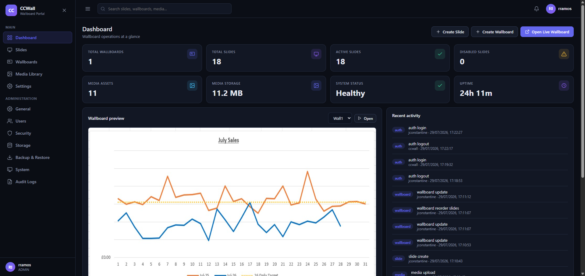
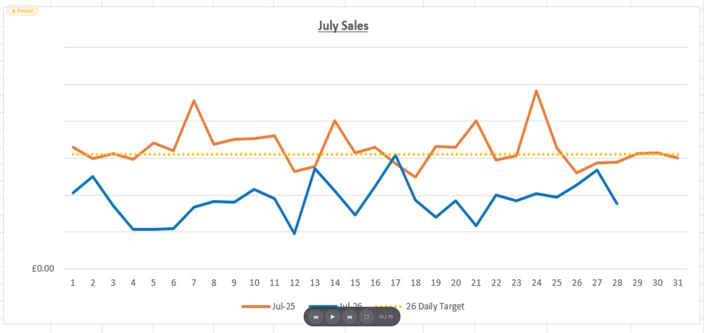
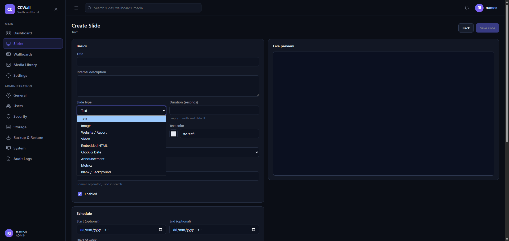
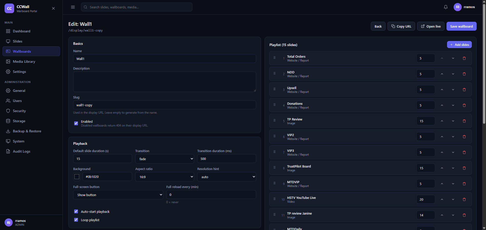
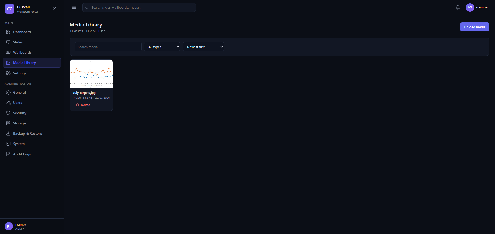
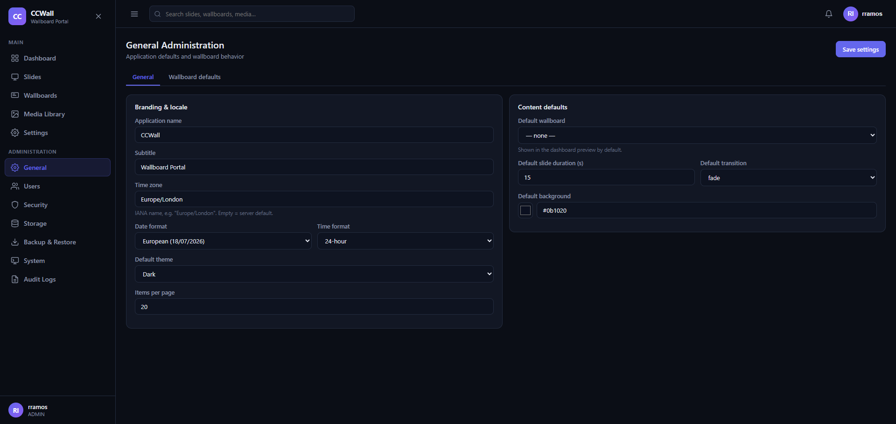

<div align="center">

# 📺 CCWall

**Self-hosted wallboard portal — build slide playlists and run them full-screen on TVs, tablets and kiosks.**

[](#-installation)
[](#casaos)
[](#zimaos)
[](#-development)
[](#-testing)
[](#-security)
[](CHANGELOG.md)

One container. One SQLite file. No cloud, no accounts, no telemetry.

</div>

---

## Contents

- [What is CCWall?](#what-is-ccwall)
- [Screenshots](#-screenshots)
- [Features](#-features)
- [Installation](#-installation)
- [How to use CCWall](#-how-to-use-ccwall)
- [Slide types reference](#-slide-types-reference)
- [Configuration](#-configuration)
- [Backup and restore](#-backup-and-restore)
- [Upgrading](#-upgrading)
- [Security](#-security)
- [Testing](#-testing)
- [Development](#-development)
- [Troubleshooting](#-troubleshooting)

---

## What is CCWall?

CCWall turns any screen into a company wallboard. You create **slides** (text, images, videos,
live web dashboards, clocks, announcements, KPI tiles), arrange them into **wallboards**
(playlists), and open a URL on the display device:

```
http://YOUR-SERVER:5599/display/main-lobby
```

The player runs full-screen with smooth transitions, auto-advances, recovers from errors, keeps
the screen awake, and picks up content changes automatically — no need to touch the TV again
after setup.

**Typical uses:** contact-centre stats, sales leaderboards, Tableau / Grafana / Power BI
dashboards, company announcements, YouTube live streams, reception displays, factory-floor KPIs.

---

## 📸 Screenshots

> Save your images into `docs/screenshots/` using the filenames below and they will appear here.
> See [`docs/screenshots/README.md`](docs/screenshots/README.md) for the shot list and tips.

| Dashboard | Live player |
|---|---|
|  |  |

| Slide editor | Wallboard editor |
|---|---|
|  |  |

| Media library | Administration |
|---|---|
|  |  |

---

## ✨ Features

### Content
- **9 slide types** — Text, Image, Website/Report (live URL), Video, Embedded HTML, Clock & Date,
  Announcement, Metrics, Blank/Background.
- **Rich announcement cards** — every card can combine text with an image, a video (upload or
  YouTube), or an embedded web page, and content **auto-shrinks to fit its card**.
- **Live editor preview** — every change renders instantly, exactly as the TV will show it.
- **Per-slide scheduling** — start/end date-time and days-of-week; expired slides drop out of the
  playlist automatically.
- **Duplicate, enable/disable, tag, change type** — plus unsaved-changes protection in the editor.

### Wallboards
- **Multiple independent playlists**, each with its own slug, transitions, timing and look.
- **Drag-and-drop ordering** (mouse *and* keyboard up/down buttons for accessibility).
- **Per-slide duration overrides** inside a playlist.
- **On-air schedules** — a wallboard can be live only Mon–Fri 08:00–18:00, for example.
- **Access modes** — public link, secret token link, or PIN-protected.
- **Aspect-ratio control** — auto, 16:9, 4:3, 21:9, 9:16 with letterboxing for odd screens.

### Player
- Full-viewport, no admin chrome, kiosk-ready.
- 5 transitions (none, fade, slide-left, slide-up, zoom) with **no white flash** between slides.
- Preloads the next slide; recovers automatically if one slide errors.
- Screen **wake lock**, cursor auto-hide, optional on-screen controls.
- Polls for playlist updates and applies them **without a browser refresh**.
- Discreet "reconnecting" indicator only when something is actually wrong.
- Interactive embedded pages — you can sign in to Tableau/Grafana right on the display.

### Administration
- Roles: **Administrator / Editor / Viewer**.
- Media library with usage tracking and in-use delete protection.
- Full **backup & restore** (database + media) and config-only JSON export.
- **Audit log** of every meaningful action, with IP addresses.
- Global search, notifications, dark **and** light themes.
- Everything configurable from the UI — no config files to edit after install.

---

## 🚀 Installation

### Requirements

- A host running **Docker** (x86-64 or ARM64) — CasaOS, ZimaOS, Synology, Raspberry Pi 4+, or any Linux box.
- ~256 MB RAM, a few hundred MB of disk plus your media.
- Port **5599** free (changeable).

### Docker (recommended)

```bash
git clone https://github.com/YOUR-USERNAME/CCWall.git
cd CCWall
mkdir -p data && sudo chown -R 1000:1000 data
docker compose up -d
```

Open **`http://YOUR-SERVER-IP:5599`** and create your administrator account.

> ℹ️ On the first run Docker prints `pull access denied for ccwall` — that is expected. Compose
> tries the registry first, finds nothing, then builds the image locally. Look for
> `✔ Container ccwall Started` at the end.

### CasaOS

1. Copy the repo to the device and build the image once:
   ```bash
   cd /DATA/AppData/CCWall && docker compose build
   ```
2. In CasaOS go to **App Store → ⋮ → Install a customized app**.
3. Paste the contents of [`docker-compose.example.yml`](docker-compose.example.yml) — it already
   contains the `x-casaos` metadata (title, port map, volume descriptions).
4. Install, then open the tile. Data lives in `/DATA/AppData/ccwall`.

### ZimaOS

ZimaOS uses the same app format as CasaOS:

```bash
ssh root@ZIMA-IP
cd /DATA/AppData && git clone https://github.com/YOUR-USERNAME/CCWall.git CCWall
cd CCWall && mkdir -p data && chown -R 1000:1000 data
docker compose up -d
```

Then browse to `http://ZIMA-IP:5599`. To get a dashboard tile, import
[`docker-compose.example.yml`](docker-compose.example.yml) via **App Store → Install a customized app**.

### From source (no Docker)

Requires **Node.js 22.12+** (CCWall uses the built-in `node:sqlite` module — no native build tools needed).

```bash
npm install
npm run build
DATA_DIR=./data PORT=5599 npm start
```

---

## 📖 How to use CCWall

### 1. First run — create the administrator

On first visit CCWall shows a **Create administrator** screen. There are no default credentials.
Choose a username and a password meeting the policy (≥ 10 characters, upper + lower case, a
number — all adjustable later in **Security**). You are signed in immediately.

### 2. Create your first slide

**Slides → Create Slide**. Pick a type, fill in the options, watch the **Live preview** on the
right, then **Save slide**.

Common fields on every slide:

| Field | What it does |
|---|---|
| **Title** | Shown on some slide types and used throughout the admin UI |
| **Duration** | Seconds on screen. Empty = the wallboard default |
| **Background / Text color** | Per-slide colours (colour picker or hex) |
| **Transition override** | Use a different transition just for this slide |
| **Schedule** | Start/end date-time and days of the week |
| **Tags** | Free-text labels, searchable from the top bar |
| **Enabled** | Disabled slides stay in the playlist but are skipped |

### 3. Create a wallboard and add slides

**Wallboards → Create Wallboard** → give it a name (the URL slug is generated for you) →
**Add slides** → drag rows to set the play order → **Save wallboard**.

Key wallboard settings:

- **Default slide duration**, **transition** and **transition duration**
- **Aspect ratio** — set `16:9` for a TV so the layout stays stable regardless of browser size
- **Loop playlist**, **auto-start**, **full-screen button** visibility
- **Full reload every N minutes** — optional hard refresh for long-running displays
- **On-air schedule** — outside the window the screen shows a standby message
- **Access** — public / token / PIN

### 4. Show it on a TV

Copy the display URL (**Copy URL** on the wallboard, or from the Wallboards list):

```
http://YOUR-SERVER:5599/display/main-lobby
```

Open it in the TV's browser and press **F** (or the ⛶ button) for full screen. For a permanent
kiosk, launch Chrome/Chromium like this:

```bash
chromium --kiosk --noerrdialogs --disable-infobars --incognito \
  http://YOUR-SERVER:5599/display/main-lobby
```

**Player keyboard shortcuts**

| Key | Action |
|---|---|
| `Space` | Pause / resume |
| `←` / `→` | Previous / next slide |
| `F` or double-click | Toggle full screen |
| `Esc` | Exit full screen |

### 5. Manage who can do what

**Administration → Users**:

| Role | Can do |
|---|---|
| **Administrator** | Everything — users, security, storage, backups, system settings |
| **Editor** | Create and manage slides, wallboards and media — no admin settings |
| **Viewer** | Read-only: dashboard and wallboards |

---

## 🧩 Slide types reference

| Type | Key options |
|---|---|
| **Text** | Heading, body, callout, footer, alignment, font size (sm–xxl), font weight. Supports safe `**bold**` / `*italic*` — raw HTML is never injected. |
| **Image** | Upload or pick from the media library, alt text, fit (contain/cover/fill/original), position, caption. |
| **Website / Report** | Any `http(s)` URL, refresh interval, scale (100/75/50 %), load timeout, custom error + fallback text. Fully interactive — you can sign in to the embedded site. |
| **Video** | Uploaded file **or** external URL, autoplay, muted, loop, fit mode, poster image. **YouTube links are auto-converted** to an embedded player. |
| **Embedded HTML** | Admin-only markup/CSS block rendered in a script-less sandbox. Can be switched off globally in Security. |
| **Clock & Date** | Time zone (IANA), 12/24-hour, seconds on/off, date format, size. |
| **Announcement** | Multi-card grid — see [below](#announcement-cards-text--media). |
| **Metrics** | KPI tiles with label, big value, delta and tone (default/success/warning/danger). |
| **Blank / Background** | Solid colour spacer or backdrop. |

### Announcement cards (text + media)

The Announcement slide is a responsive grid of cards. Configure the whole slide once, then
override anything on individual cards.

**Slide-level (Layout & default style)**
- **Cards per row** — Auto (fit to width) or a fixed 1, 2, 3 or 4
- **Font family** — sans-serif (default), serif or monospace
- **Alignment**, **title size**, **body size** (sm/md/lg/xl)
- **Title colour**, **body colour**, **card background**

**Per card**
- **Title** and **body** (supports `**bold**` / `*italic*`)
- **Media in this card** — Text only · Image · Video (upload or YouTube) · Website / embedded page
  - **Position** — above, below, left, right, or *behind* the text
  - **Media size** — 30 %, 45 %, 65 % or fill the card
  - **Fit** — Contain (show it all) or Cover (fill, may crop)
  - **Alt text** for images
- **Style overrides** — alignment, title/body size and colour, card background

Card content **automatically scales down to fit** its card, so long text and mixed media never
overflow the rounded borders — on a 4K TV or a phone. "Fill the card" media takes whatever space
the text leaves, so a card can never push its own content out.

### 🔐 Embedding dashboards that need a login (Tableau, Grafana, Power BI)

Website/Report slides are fully interactive, so you can authenticate right on the display:

1. Open the live wallboard **on the display device** (the session is stored in that browser).
2. Press `Space` to pause so the slide doesn't rotate away.
3. Click **Sign in** inside the slide and log in normally.
4. Press `Space` to resume.

Set that slide's **Refresh interval to 0** so a reload doesn't discard the session. For a
permanently unattended screen, prefer a server-side option on the dashboard product itself
(Tableau *connected apps* / trusted authentication, Grafana anonymous or API-key dashboards).

> ⚠️ Some sites send `X-Frame-Options`/`Content-Security-Policy` headers that forbid embedding
> entirely. CCWall cannot and will not bypass those — it shows your configured fallback message
> instead.

### ▶️ YouTube and live streams

Paste **any** YouTube link into a **Video** slide, a **Website/Report** slide, or an
**Announcement card** — watch URLs, `youtu.be` short links, Shorts, `/live/VIDEO_ID` and channel
live pages are all converted automatically to the privacy-friendly `youtube-nocookie.com` player.

For a channel that streams regularly, use the channel form so you never have to edit the slide:

```
https://www.youtube.com/channel/UCxxxxxxxxxxxxxxxxxxxxxx/live
```

Keep **Muted** enabled — browsers block unmuted autoplay. (Embedded HTML slides cannot host
YouTube embeds because scripts are blocked there by design.)

---

## ⚙️ Configuration

### Environment variables

| Variable | Default | Purpose |
|---|---|---|
| `PORT` | `5599` | HTTP port inside the container |
| `DATA_DIR` | `/app/data` | Persistent data directory |
| `SESSION_SECRET` | *(auto-generated)* | Session secret; generated into `$DATA_DIR/session-secret` if unset |
| `TZ` | `Etc/UTC` | Container time zone |
| `TRUST_PROXY` | `false` | Set `true` (or a hop count) behind a reverse proxy |
| `LOG_LEVEL` | `info` | `debug` / `info` / `warn` / `error` (also settable in the UI) |
| `MAX_UPLOAD_SIZE_MB` | `200` | Upload cap (also settable in Settings → Storage) |

See [`.env.example`](.env.example) for the annotated version.

### Volumes

| Container path | Contents |
|---|---|
| `/app/data` | SQLite database + generated session secret |
| `/app/data/uploads` | Media library files |
| `/app/data/backups` | Backup archives |

Everything lives under one mount, so a single directory copy moves the whole installation.

### Settings in the UI

| Tab | Covers |
|---|---|
| **General** | App name, subtitle, logo, favicon, language, time zone, date/time format, default theme, default wallboard, default slide duration, transition and background, items per page |
| **Wallboard** | Loop, auto-start, show controls, hide cursor after N seconds, playlist refresh interval, preload next slide, error fallback duration, default resolution and aspect ratio, keep screen awake |
| **Security** | Session timeout, remember-me duration, password policy (length, number, mixed case, symbol), max login attempts, lockout minutes, allowed origins, public display access, require wallboard tokens, allow embedded HTML |
| **Storage** | Data directory info, media usage, max upload size, allowed media types, clean up unused media |
| **System** | Version, uptime, database size, environment info (no secrets), log level, audit retention |

---

## 💾 Backup and restore

**Administration → Backup & Restore**

- **Create full backup** — zip containing a database snapshot, a config export and all media.
  Stored in `/app/data/backups` and downloadable from the table.
- **Download export.json** — config-only export (settings, wallboards, slides, metadata) with
  **no password or PIN hashes**.
- **Restore** — upload either file. CCWall validates the manifest, shows exactly what it contains
  (counts + creation date), and requires explicit confirmation before replacing anything.
  User accounts and passwords are never overwritten by a restore.

Host-level alternative: stop the container and copy the whole `data/` directory.

---

## 🔄 Upgrading

```bash
cd /path/to/CCWall
git pull
docker compose up -d --build
```

Database migrations run automatically at startup. Your data, media and settings persist in the
mounted volume. Hard-refresh the browser (`Ctrl`+`Shift`+`R`) afterwards so it picks up the new
frontend bundle, and reload the wallboard on each display device.

---

## 🔒 Security

| Area | Implementation |
|---|---|
| Passwords | bcrypt (cost 12), configurable policy |
| Sessions | Server-side, tokens stored hashed; HttpOnly + SameSite=Lax cookies, `Secure` over HTTPS |
| CSRF | SameSite cookies plus an Origin check on every state-changing request |
| Brute force | Per-IP rate limiting and per-account escalating lockout |
| Authorization | Role checks on every protected endpoint |
| Uploads | Extension/MIME allowlist, size limit, random generated filenames, no path traversal |
| Headers | CSP, `X-Content-Type-Options`, `X-Frame-Options`, `Referrer-Policy`, `Permissions-Policy` |
| Errors | Central handler — stack traces are never sent to clients |
| Privacy | No telemetry, no analytics, no external calls except the URLs *you* configure |

**Deployment advice:** terminate TLS in a reverse proxy (Caddy, Traefik, NPM) and set
`TRUST_PROXY=true`; keep the *admin* role limited; treat full backup zips as secrets.
Full details in [SECURITY.md](SECURITY.md).

---

## 🧪 Testing

```bash
npm run typecheck   # strict TypeScript, both workspaces
npm run lint        # eslint
npm test            # 80 tests
npm run build       # production build
```

**80 automated tests:** 60 server integration tests (authentication, lockout, CSRF, RBAC, slide
and wallboard CRUD, playlist ordering, settings persistence, upload validation, public/token/PIN
display access, schedule filtering, backup/restore round-trip, plus a full end-to-end workflow)
and 20 frontend component tests (slide rendering for every type, YouTube URL conversion,
announcement styling and media cards, pagination, dialogs).

---

## 🛠️ Development

```bash
npm install
npm run dev:server   # API on http://localhost:5599
npm run dev:web      # Vite dev server on http://localhost:5173 (proxies /api)
```

### Architecture

```
CCWall/
├── server/                 Node.js + TypeScript + Express 5 + SQLite (node:sqlite)
│   ├── src/
│   │   ├── routes/         REST API: auth, slides, wallboards, media, settings,
│   │   │                   display, users, backup, misc (stats/search/audit/system)
│   │   ├── lib/            sessions, passwords, rate limiting, audit, scheduling,
│   │   │                   settings, slugs, serialization, HTTP helpers
│   │   ├── middleware/     auth (RBAC) and CSRF
│   │   ├── db/             connection + ordered migrations
│   │   ├── schemas.ts      zod validation shared by every write endpoint
│   │   └── app.ts          Express app: security headers, CSP, static SPA, routes
│   └── test/               vitest + supertest integration suites
├── web/                    React 18 + TypeScript + Vite + React Router
│   ├── src/
│   │   ├── pages/          admin screens (+ pages/admin for the admin section)
│   │   ├── player/         live wallboard player and slide renderers
│   │   ├── components/     layout shell, shared UI, media picker, icons
│   │   ├── api.ts          typed fetch layer + data hooks
│   │   └── theme.css       design tokens (dark + light)
│   └── src/test/           vitest + Testing Library component tests
├── docs/                   API reference, migration notes, screenshots
├── starter/                original static prototype this project grew from
├── Dockerfile              multi-stage build, non-root runtime, healthcheck
└── docker-compose*.yml     deployment (with CasaOS x-casaos metadata)
```

The production container serves the built SPA and the API from a single Node process on port
5599. There is no external database, cache or queue.

**More docs:** [API reference](docs/API.md) · [Database migrations](docs/MIGRATIONS.md) ·
[Security policy](SECURITY.md) · [Changelog](CHANGELOG.md) ·
[Implementation notes](IMPLEMENTATION_PLAN.md)

---

## 🩺 Troubleshooting

| Symptom | Fix |
|---|---|
| `pull access denied for ccwall` during `docker compose up` | Harmless — Compose checks the registry, then builds locally. Confirm `✔ Container ccwall Started`. |
| Container restarts in a loop; logs show `EACCES … /app/data` | The data directory is root-owned but the container runs as UID 1000: `chown -R 1000:1000 <host-data-dir>` then `docker compose up -d`. |
| Port 5599 already in use | Change the published port in `docker-compose.yml`, e.g. `"8080:5599"`. |
| Setup screen never appears | An account already exists — go to `/login`. To start over: stop the container and delete `data/ccwall.db*`. |
| Locked out of the only admin account | Wait for the lockout to expire (15 min by default), or restore a backup. |
| A Website/Report slide stays blank | The site blocks embedding (`X-Frame-Options`/CSP). Nothing can be done from CCWall's side — use its fallback message or an alternative URL. |
| YouTube shows a player error | Confirm embedding is allowed for the video in YouTube Studio, and that CCWall is on the latest build. |
| Changes don't appear after an update | Rebuild (`docker compose up -d --build`), then hard-refresh (`Ctrl`+`Shift`+`R`) and reload the display device. |
| Client IPs in audit logs show the proxy | Set `TRUST_PROXY=true`. |
| Media missing after moving hosts | Copy the whole `data/` directory, not just the database. |

Check container logs with:

```bash
docker logs ccwall --tail 50
```

---

## 📄 License

No licence has been chosen yet. Add a `LICENSE` file (MIT is a common choice for self-hosted
tools) before sharing this repository publicly.

<div align="center">
<sub>Built for teams who want their numbers on the wall — and their data on their own server.</sub>
</div>
